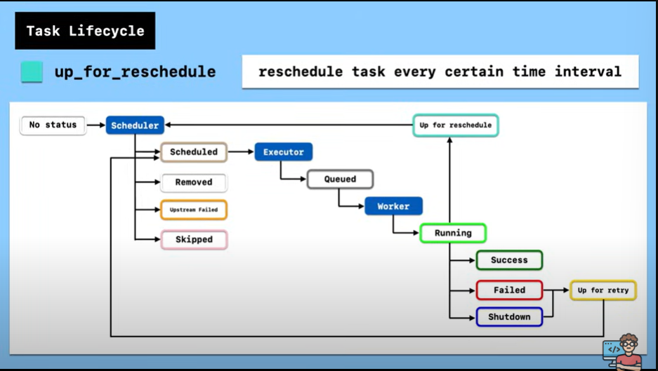

# APACHE AIRFLOW BASIC CONCEPT

## What Is Airflow
- Starts in Airbnb 2014
- Manage Complex workflow
- Top-level apache project 2019
- Workflow management platform
- Written in Python

## Workflow 
workflow is defined as series of task, workflow is defined as DAG, namely directed acyclic graph. 

## DAG, TASK, Operator
- DAG's are the primary way to orcestrate data pipelines, they are built from python and use a wide variety of supporting libraries.
Fundamentally, DAG are comprised of task, operators and sensors. There are new techniques that have been introduced over the years, relating to task group and deferrable operators, that will also cover in this chapters.

- Task defines a unit of work within a DAG as shown in the exmple DAG, it is repesented as a node in DAG,and it is written in python
- Depedency between task
- The Goal of the task is to achive a specific thing, the method is uses is called operator
- While DAG describe how to run a workflow Operatore determine what actual get done by a task. In Airflow, there are many kind of operator like Bashoperator, pythonoperator etc

To Sum up, the operator detemines what is going to be done. The Task implements an operator by defining spesific value for that operator and dag is a collection of all the task you want to run.

### DAG 
a DAG is a collection of all the tasks you want to run, organized in a way that reflects their dependencies
- it helps you define the structure of your entire workflow, showing tasks need to happen before others.

### Operator 
an operator defines a single, ideally idempotent, task in your DAG
Operators allow you to break down you workflow into discreate, manageable piece of work

Airflow has thousand of Operators
- The PythonOperator to execute a Python script or function
- The BashOperator to execute a bash script or command
- The SQL ExecuteQueryOperator to execute a SQL Query to a Database
- The Filesensor to wait for a file

#### Type Of Operator :
Action Operator : Execute an Action
Transfer Operator : Transfer Data
Sensor : Wait for a condition to be met

### Task / Task Instance
- A Task is a Specifice instance of an operator. when an operator is assigned to a DAG, it becomes a task

## Workflow 
A workflow is the entire process defined by your DAG, including all task and their depedencies.

## Execute Date, Task Instance and DAG run :
- The execution_date is the logical date and time which the DAG run, its task instances
- Task Instance is a run of a task at a specific point of time
- DAG RUN is instantiation of a DAG, containing task instances that run for a specific execution_date

# Architecture
## Single Node Architecture
- A node is a single computer or server
- A single node architecture means all components of airflow are running on one machine (this is the typical setup you get when install and run airflow)
- 
# TASK LIFECYCLE AND BASIC ARCHITECTURE
- There are in total 11 different kinds of stages. In the Airflow UI

- no_status : scheduler created empty task instance

- scheduled : scheduler determined task instances need to run

- queued : scheduler sent task to executor to run on the queue

- running : worker picked up a task and is now running it

- success : Task completed without error

- upstream_failed : the task's upstream task filed

- up_for_reschedule : reschedule task every certain time interval

- skipped : task is skipped

- up_for_retry : rerun the task

- failed : Task is failed

- shutdown : Task run has been shutdown

# Basic Architecture

- Data Engineer | Bulding and monitoring ETL processing | Airflow.cfg
- 
